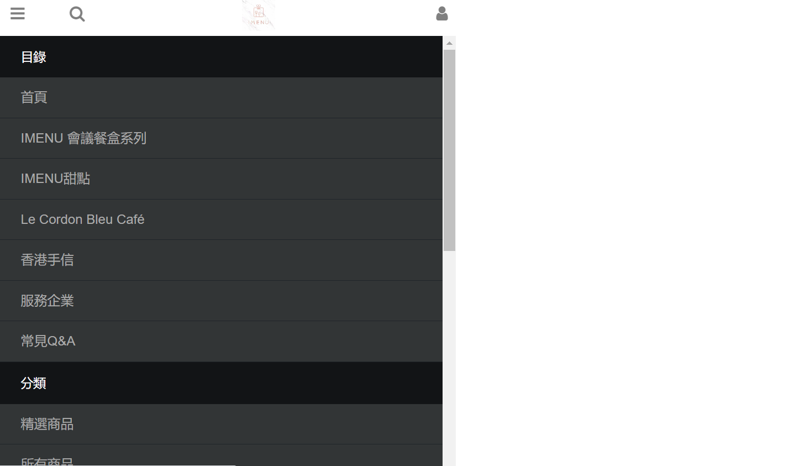
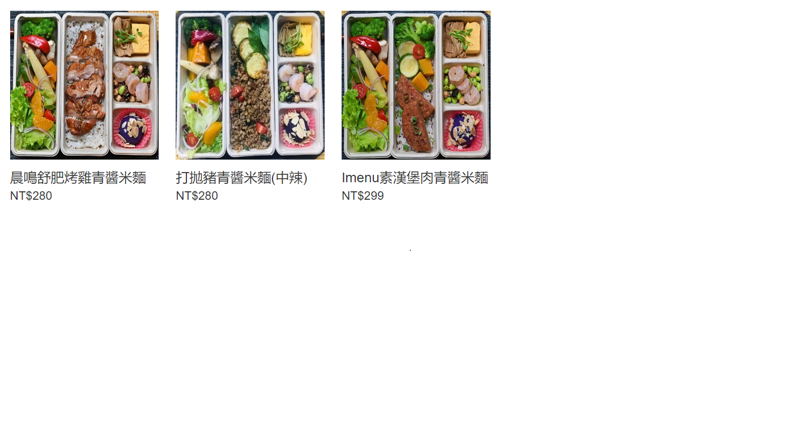
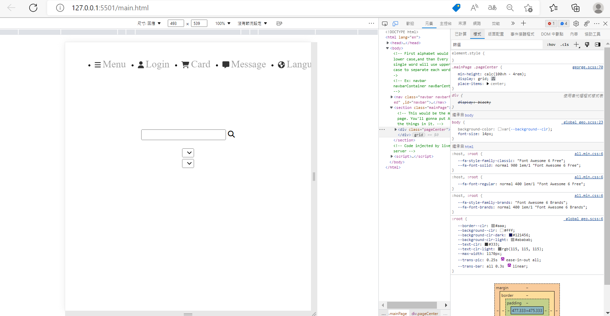
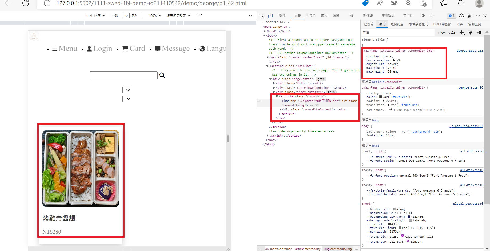
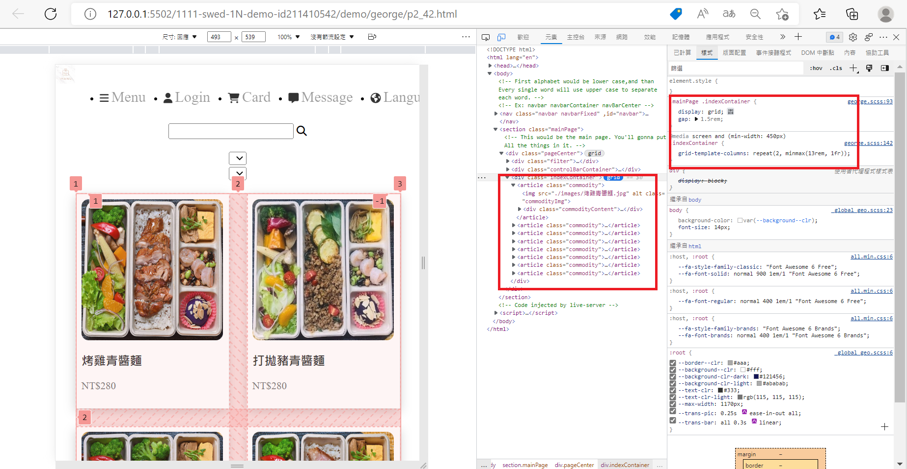

### 學號 姓名 補救教學
211410542 陳思語

## Github & Vercel URL

[Github URL](https://github.com/htchung/1111-web-demo-id)

[Vercel URL](https://1111-web-demo-id-kd9e.vercel.app/)
### 第一部分

#### 1.1 提供 theme 來源 URL 及圖片:

Theme 來源網址: [Theme](https://imenu.shoplineapp.com/categories/imenu)
Theme 截圖: 

#### 1.2 theme 介紹:

本 Theme 可以拆分成以下部分

1. 側面 Menu，共可分成 5 個種類
   

```
<div>...</div>
```

> 文字說明

2. 卡片區，可顯示產品圖片、名稱、價格、種類
   

```
<div>...</div>
```

> 文字說明
完成以上版面，且與網站大致相像(選單失敗QQ)
---

### 第二部分

### 實作框架


### p1 一張Card


### p2 6張以上Card



### 第三部分

### 做出側邊選單 雛形


