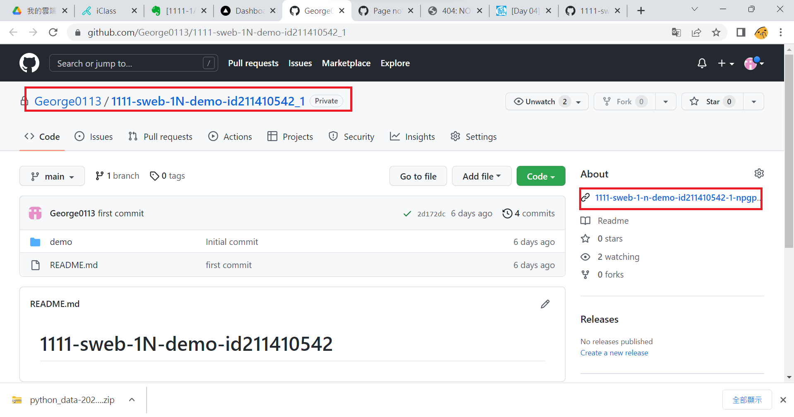
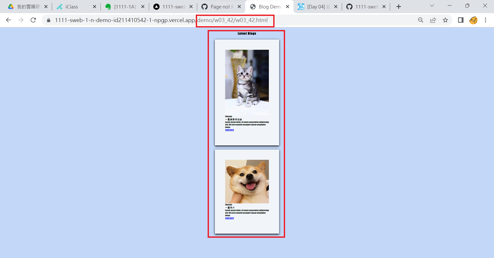
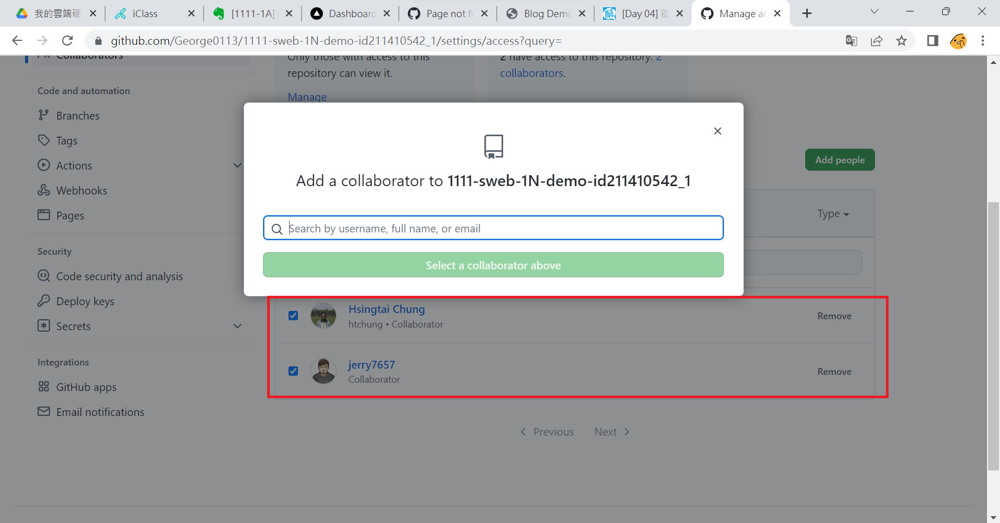
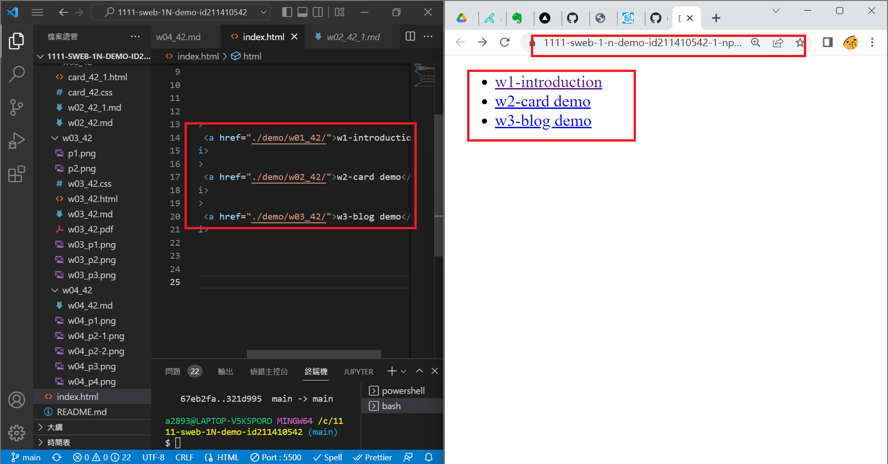
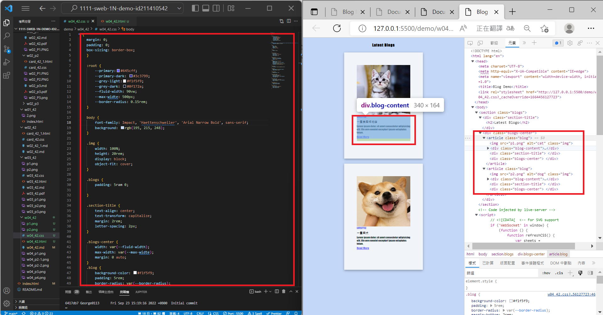
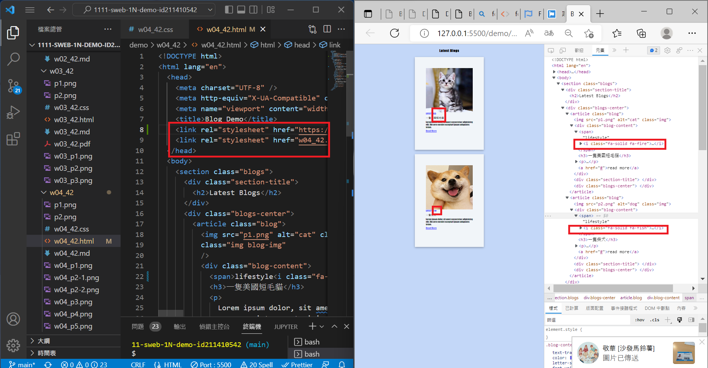
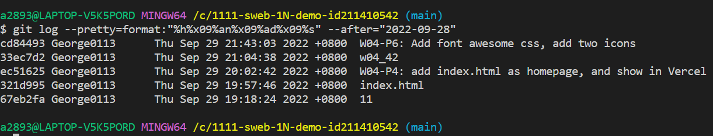

### W04_42-P1 Use git pull to update README.md


### w04_42-P2: Deploy Github to Vercel



### w04_42-P3: Share Github repo to teacher and TA


### W04_42-P4: add index.html as homepage, and show in Vercel



### W04_42-P5: finish w03 blog demo with hover and transition


### W04-P6: Add font awesome css, add two icons



### w04 all log



```
$ git log --pretty=format:"%h%x09%an%x09%ad%x09%s" --after="2022-09-28"
cd84493 George0113      Thu Sep 29 21:43:03 2022 +0800  W04-P6: Add font awesome css, add two icons
33ec7d2 George0113      Thu Sep 29 21:04:38 2022 +0800  w04_42
ec51625 George0113      Thu Sep 29 20:02:42 2022 +0800  W04-P4: add index.html as homepage, and show in Vercel
321d995 George0113      Thu Sep 29 19:57:46 2022 +0800  index.html
67eb2fa George0113      Thu Sep 29 19:18:24 2022 +0800  11
```