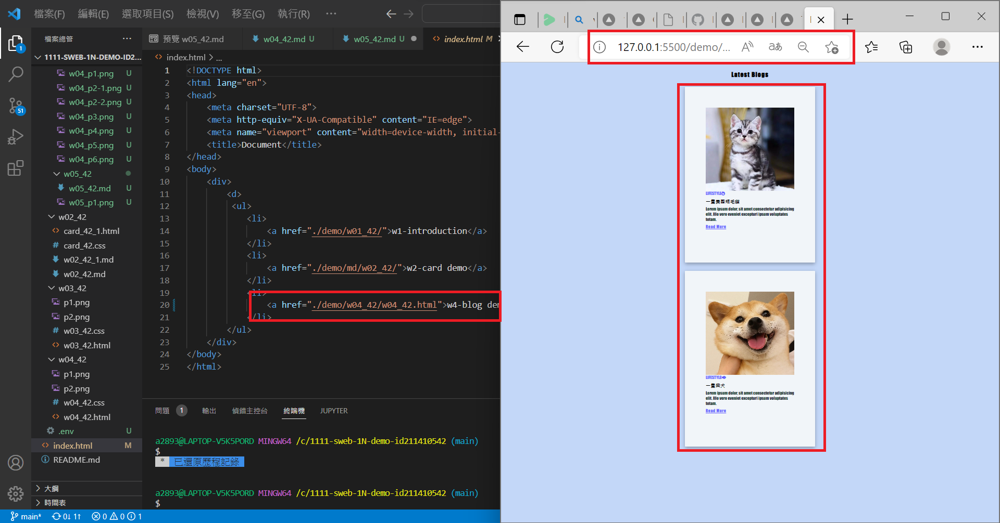
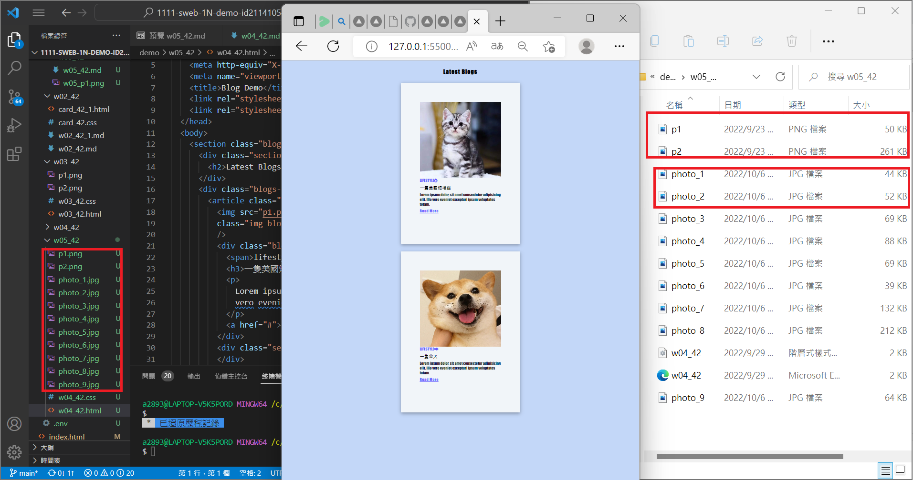
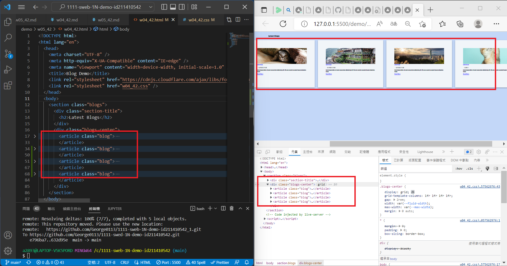
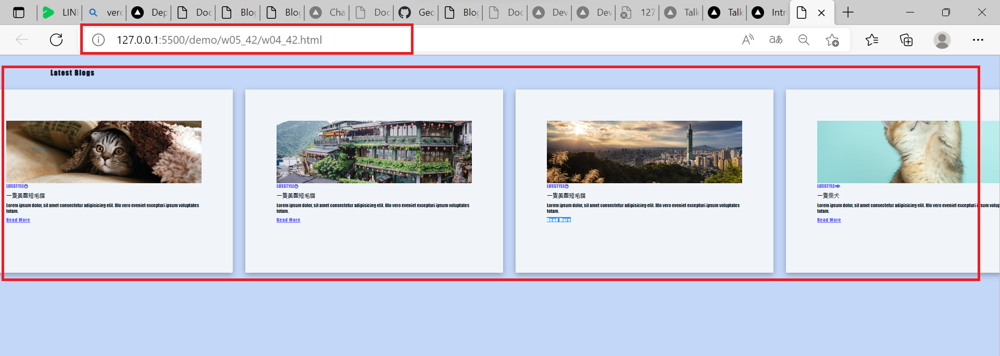
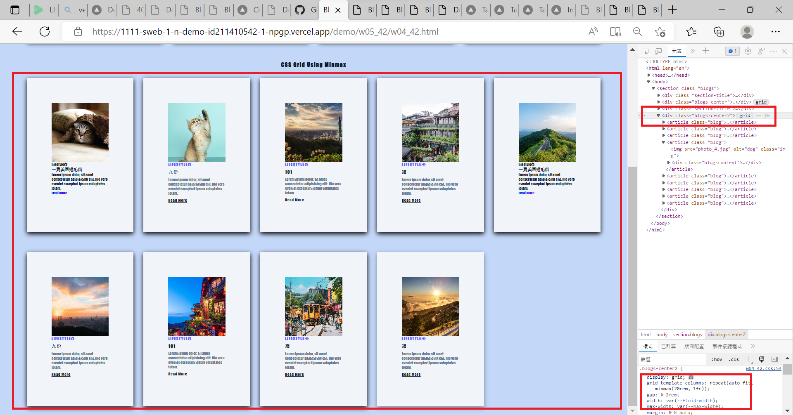
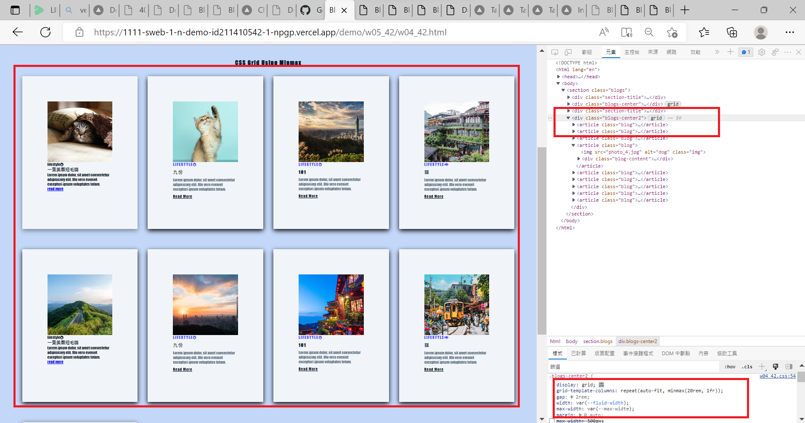
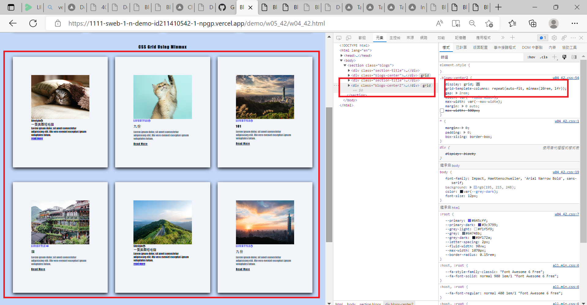
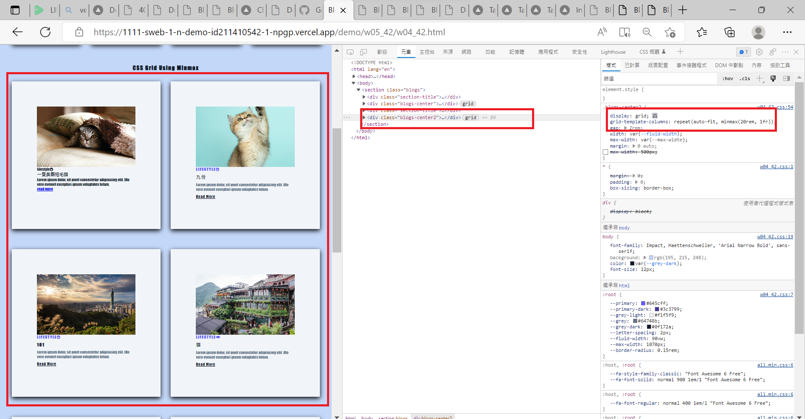
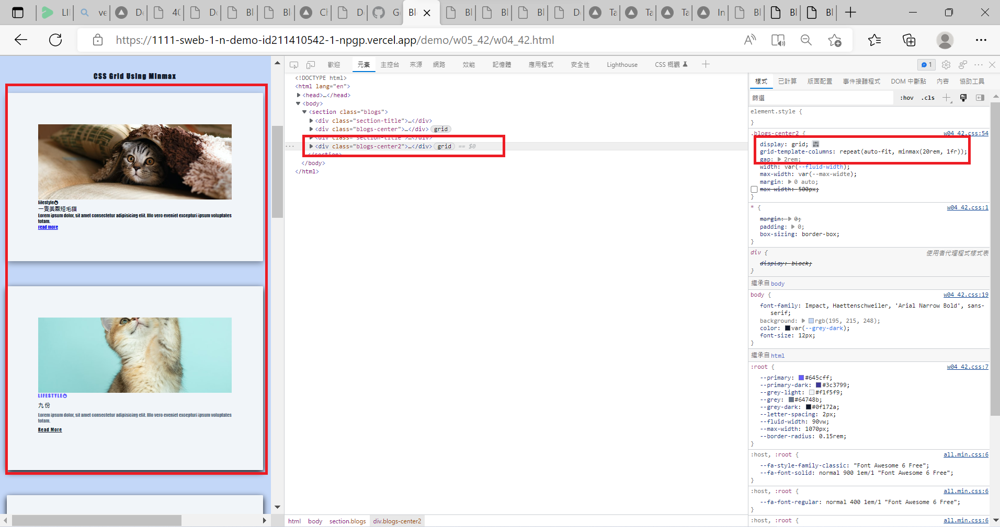
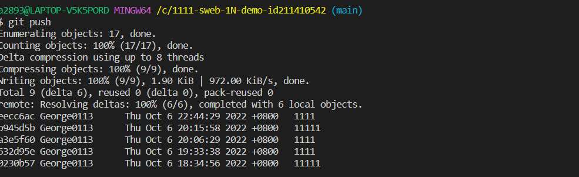

### W05_42-P1 add w04 link in index.html

### W05-P2: get 9 photo using small sizes

### W05-P3: Use grid to show 4 photos in a row

### W05-P4: Add w05 link in index.html, and show it in Vercel

### W05-P5: Using css grid with minmax to display 9 photos

### W05-logs: W4 all logs

$ git log --pretty=format:"%h%x09%an%x09%ad%x09%s" --after="2022-10-05"
eecc6ac George0113      Thu Oct 6 22:44:29 2022 +0800   1111
b945d5b George0113      Thu Oct 6 20:15:58 2022 +0800   11111
a3e5f60 George0113      Thu Oct 6 20:06:29 2022 +0800   1111
632d95e George0113      Thu Oct 6 19:33:38 2022 +0800   1111
0230b57 George0113      Thu Oct 6 18:34:56 2022 +0800   11111