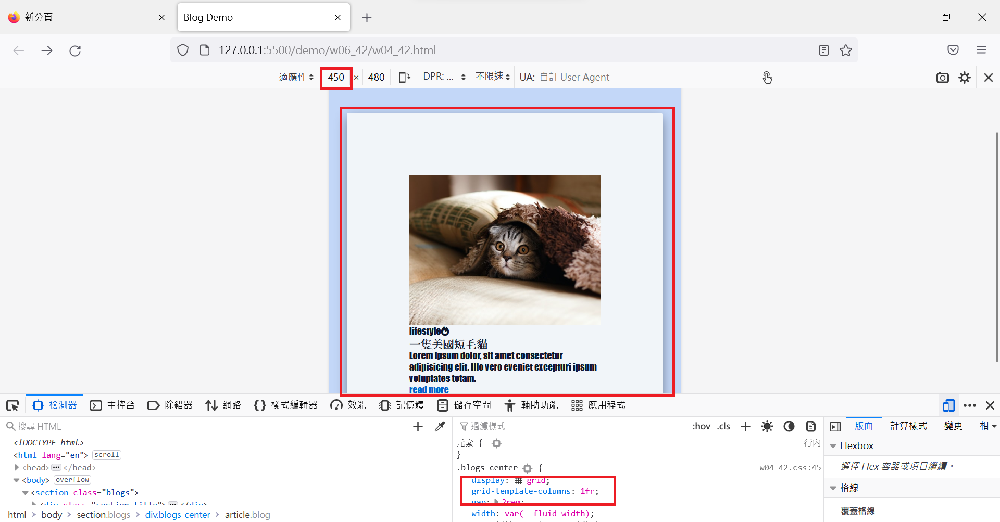
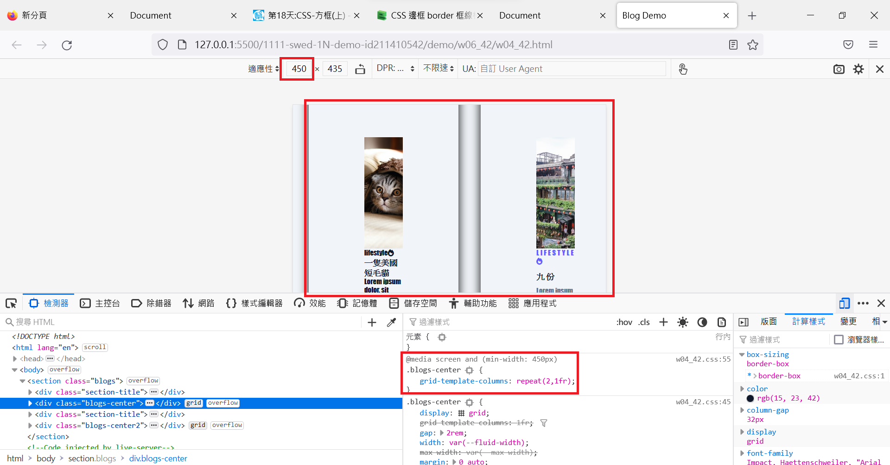
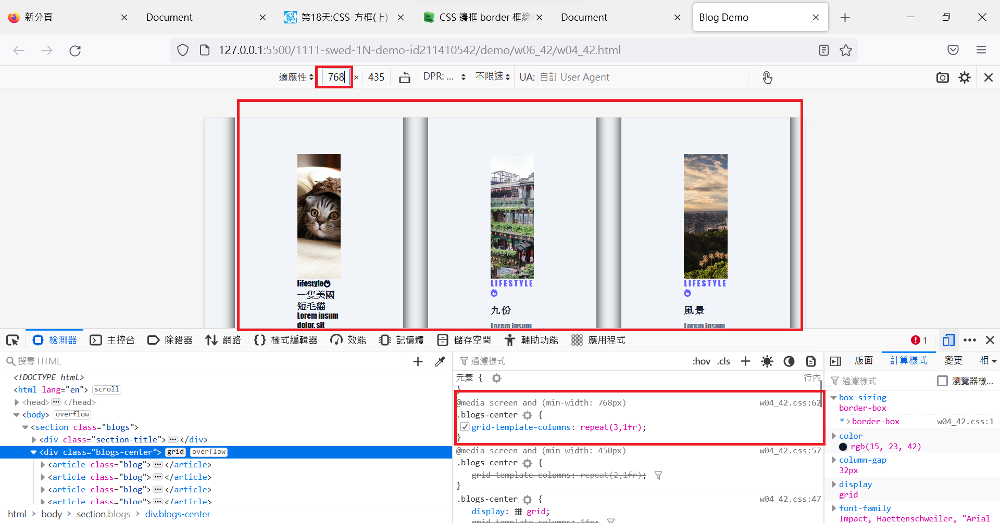
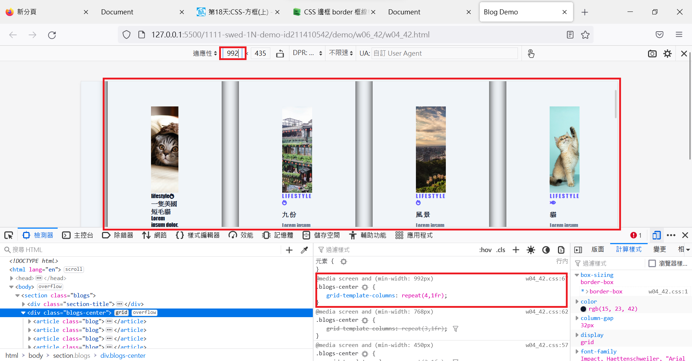
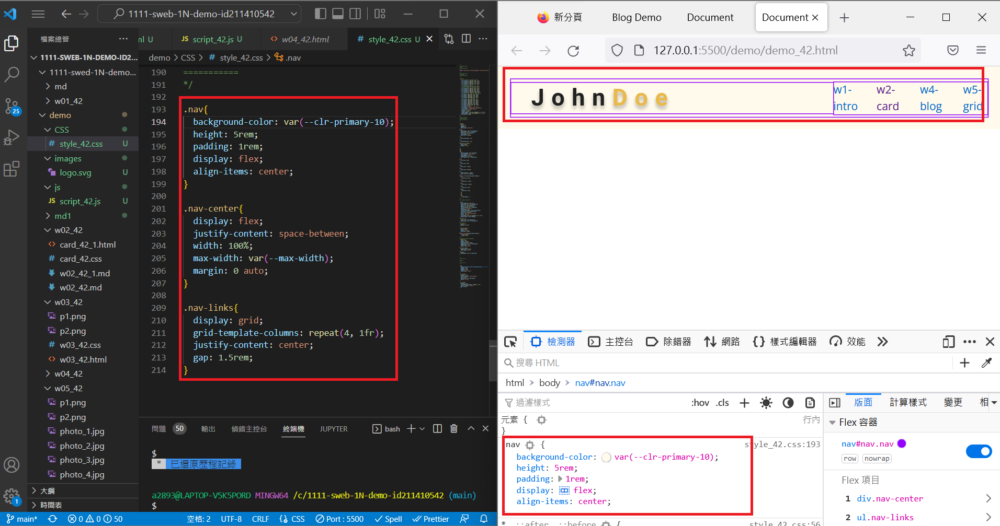
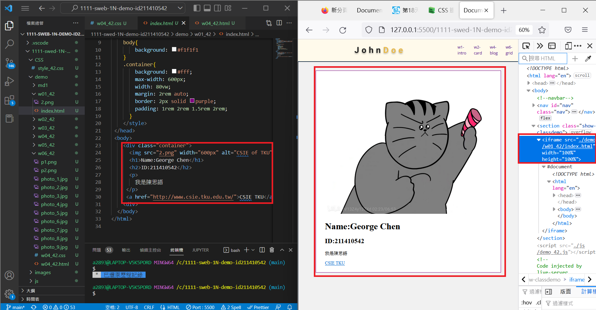
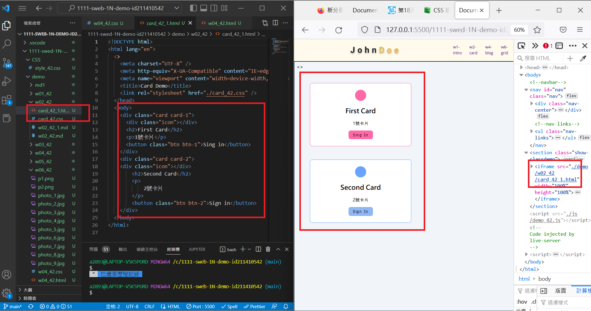
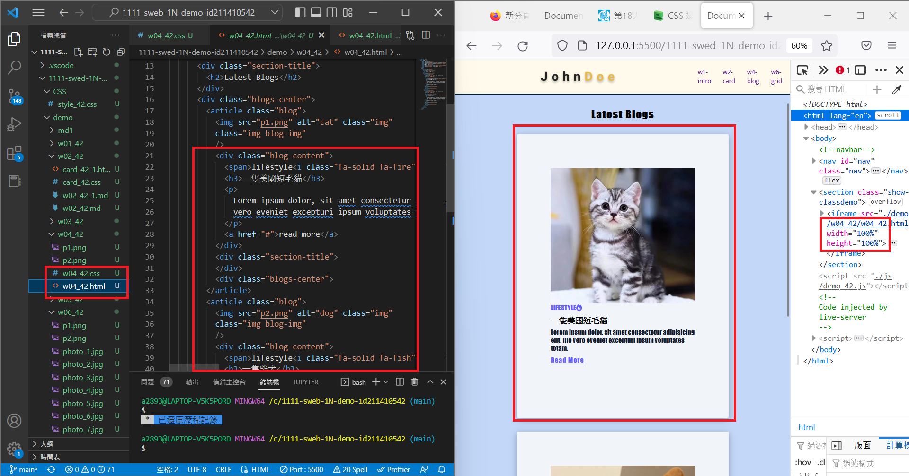
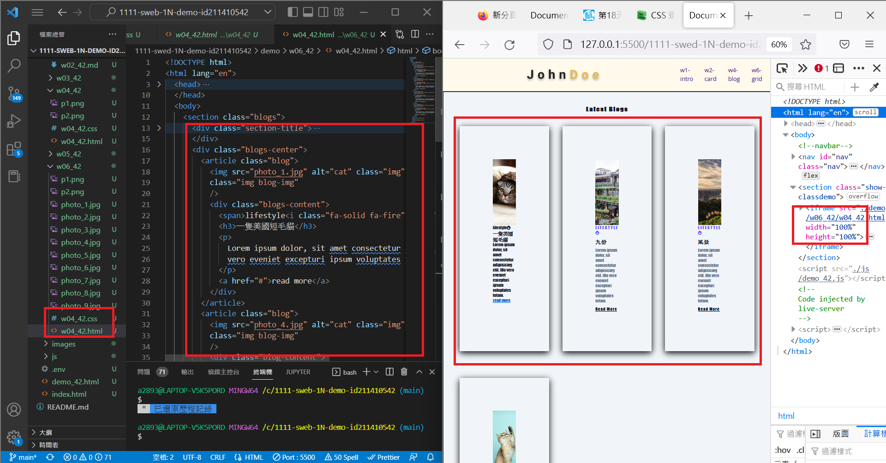
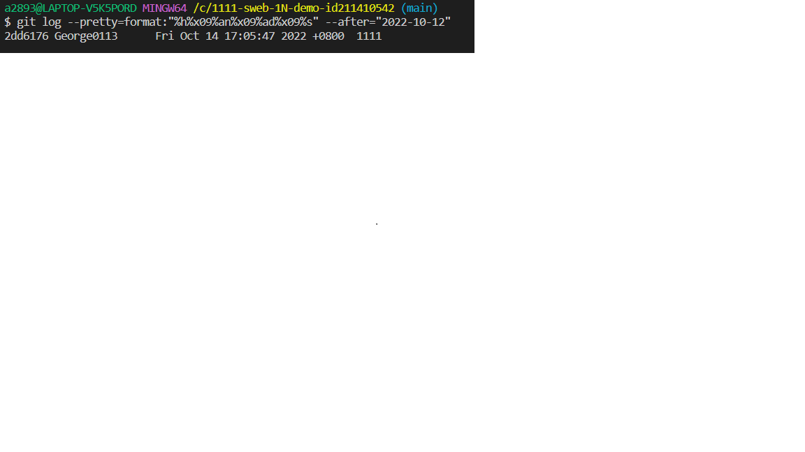

### W06-P1: add 3 breakpoints for different devices

### W06-P2: add navbar for demo links

### W06-P3: run 4 classdemo one by one

### W06-logs: W4 all logs

$ git log --pretty=format:"%h%x09%an%x09%ad%x09%s" --after="2022-10-12"
2dd6176 George0113      Fri Oct 14 17:05:47 2022 +0800  1111