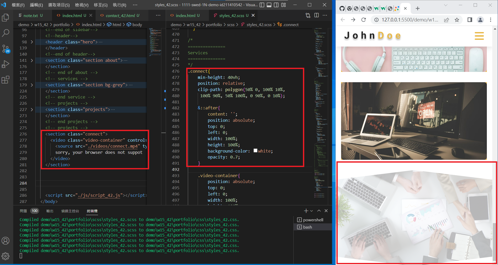
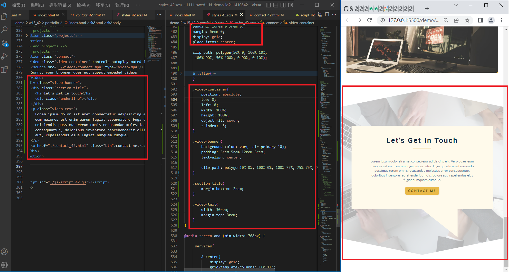
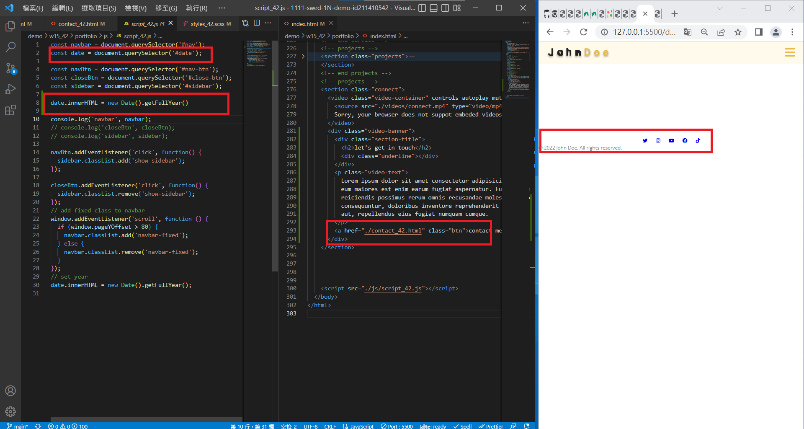
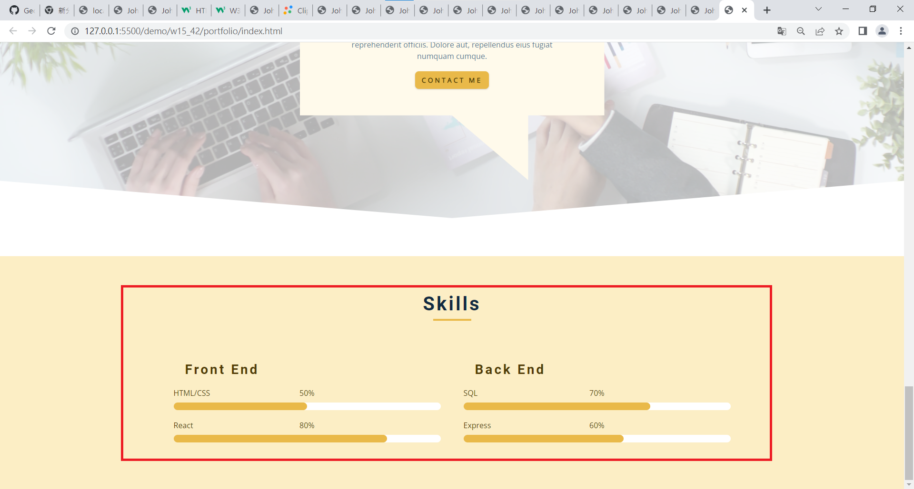
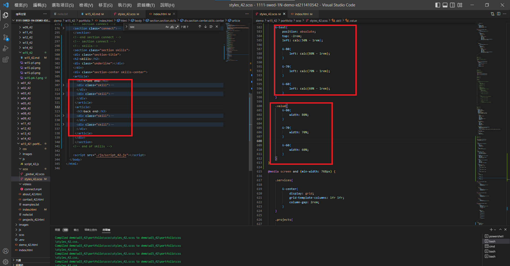
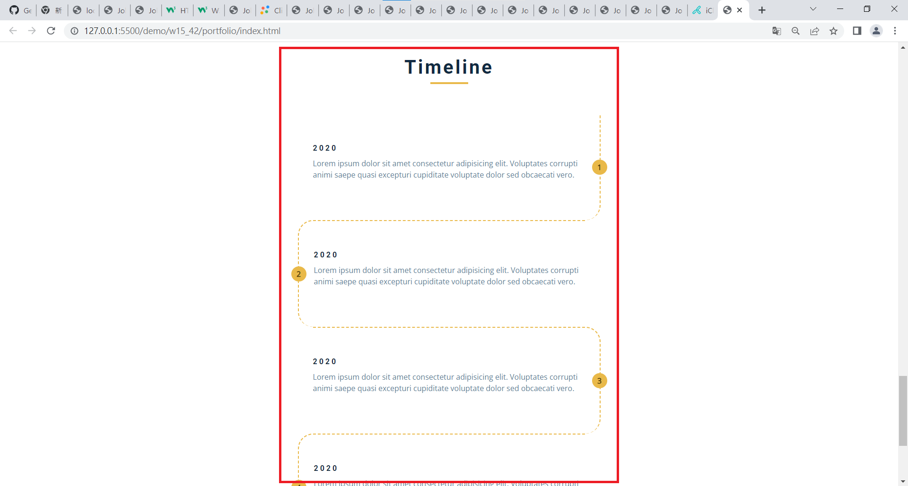
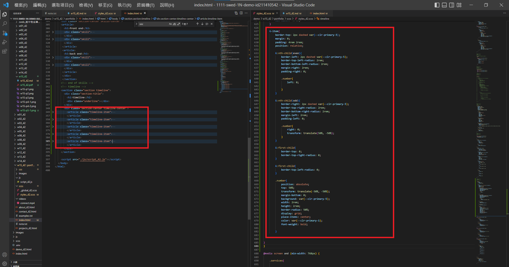

## Github & Vercel URL

[Github URL](https://github.com/htchung/1111-web-demo-id)

[Vercel URL](https://1111-web-demo-id-kd9e.vercel.app/)


### W15-P1: connect section using mp4 video
 


### W15-P2: add video banner
 


### W15-P3: show contact_xx.html with navbar and footer with date shown in year
 


### W15-P4: 完成 skills 進度條
 



### W15-P5: 完成 timeline 時間軸




```
$ git log --pretty=format:"%h%x09%an%x09%ad%x09%s" --after="2022-12-14"
bb73514 George0113~     Thu Dec 15 22:02:05 2022 +0800  完成 timeline 時間軸
6a66da7 George0113~     Thu Dec 15 21:20:43 2022 +0800  完成 skills 進度條
cc94214 George0113~     Thu Dec 15 20:17:08 2022 +0800  add video banner
dcfb56d George0113~     Thu Dec 15 19:24:01 2022 +0800  connect section using mp4 video
```